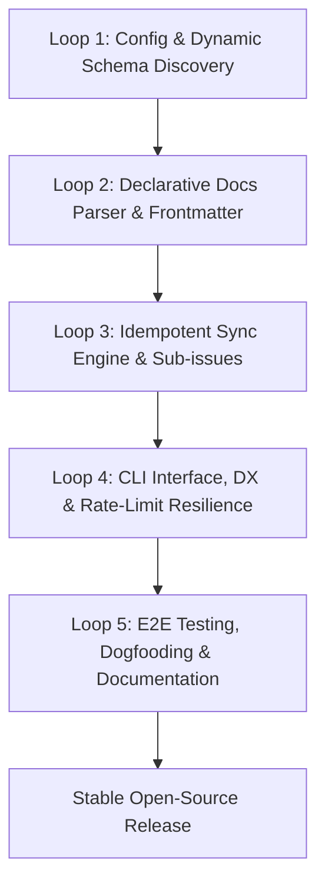

# SPEC-001: GitHub Docs-to-Project Sync Engine (Generic)

## 1. Overview & Context

### 1.1 Objective
Transform the original script (`cadastrar-historias.mjs` / `sync-stories.mjs`) — originally developed with tightly coupled metadata for a specific repository — into a generic, modular, declarative **Docs-as-Code** engine.

The system ingests structured agile documentation from a `docs/` directory (roadmap, sprints, epics, and user stories), dynamically queries the GitHub GraphQL & REST APIs via the GitHub CLI (`gh`), and idempotently synchronizes **GitHub Issues**, **Sub-issues**, and custom fields on **GitHub Projects v2**.

### 1.2 Current Problem Statement
The legacy script contains:
1. **Hardcoded infrastructure IDs**: Project ID (`PVT_...`), field IDs (`PVTSSF_...`), and single-select option IDs (`79628723`, etc.) are hardcoded.
2. **Coupled domain & business metadata**: In-memory dictionaries for story metadata (`STORY_METADATA`), epic lists (`EPICS`), sprint dates (`SPRINTS`), and repository/milestone names are directly embedded in code.
3. **Low reusability**: Adopting the tool in a new repository requires manual GraphQL inspection and editing dozens of lines of source code.

### 1.3 Engineering Principles
- **Strict Idempotency**: Running the sync process $N$ consecutive times must result in the exact same state on GitHub without creating duplicate issues or resetting existing progress.
- **Zero Hardcoded IDs**: All internal GitHub Projects v2 IDs must be dynamically discovered at runtime using the GitHub CLI (`gh`).
- **Docs-as-Code**: Markdown files in the `docs/` folder serve as the single source of truth (SSOT).
- **Graceful Degradation & Resilience**: Native handling of GitHub API rate limits using exponential backoff and `x-ratelimit-reset` header parsing.
- **Dry-run First**: Every command must support a comprehensive `--dry-run` simulation mode to display execution plans before performing mutations on GitHub.

---

## 2. Architecture & System Design

### 2.1 Layered Architecture

```
+-------------------------------------------------------------+
|                        CLI Interface                        |
|   Flags: --config, --docs-dir, --epic, --dry-run, --verbose  |
+-------------------------------------------------------------+
                               |
                               v
+-------------------------------------------------------------+
|                 Docs Ingestion & Parsers                    |
|   - Roadmap / Sprints Parser (YAML / Markdown / JSON)       |
|   - Epics Parser (Markdown + Frontmatter)                   |
|   - User Stories Parser (Markdown + Frontmatter)            |
+-------------------------------------------------------------+
                               |
                               v
+-------------------------------------------------------------+
|                GitHub Dynamic Discovery Layer               |
|   - Dynamic Project ID resolution by number & owner         |
|   - Field IDs and Single-Select Option IDs discovery        |
|   - Local repository cache for Issues & Milestones          |
+-------------------------------------------------------------+
                               |
                               v
+-------------------------------------------------------------+
|                  Idempotent Sync Engine                     |
|   - Create / Update Issues (Epics & Stories)                |
|   - Sub-issue Linker (GraphQL AddSubIssue mutation)         |
|   - Project V2 Item Add & Field Value Assignment            |
+-------------------------------------------------------------+
                               |
                               v
+-------------------------------------------------------------+
|                 GitHub CLI & GraphQL Runner                 |
|   - Rate-limit handler with automatic pause/resume          |
|   - Safe retries and buffer management                      |
+-------------------------------------------------------------+
```

---

## 3. Data Contracts (`docs/` Directory Specification)

The engine supports metadata defined via **YAML Frontmatter** in Markdown headers (modern documentation standard) with graceful fallbacks.

### 3.1 Sprints / Roadmap File (`docs/sprints.yml` or `docs/roadmap.json`)
Defines the iteration calendar.
* **Schema (YAML)**:
```yaml
sprints:
  1:
    name: "Sprint 1 - Foundation & Core Sync"
    start: "2026-10-06"
    end: "2026-10-20"
  2:
    name: "Sprint 2 - Advanced DX & Polish"
    start: "2026-10-21"
    end: "2026-11-04"
```

### 3.2 Epic Files (`docs/user-stories/<epic-folder>/<epic-file>.md`)
Each epic contains its own specification file with frontmatter metadata:
```markdown
---
code: "EP-01"
name: "Docs-as-Code Sync Engine for GitHub Projects v2"
priority: "P0"
size: "XL"
estimate: 13
startDate: "2026-10-06"
targetDate: "2026-10-20"
milestone: "v1.0.0 - MVP"
---

# Epic 01 - Docs-as-Code Sync Engine for GitHub Projects v2

## Overview
High-level description of business and engineering goals...
```

### 3.3 User Story Files (`docs/user-stories/<epic-folder>/*.md`)
Each user story is represented by an individual Markdown document:
```markdown
---
code: "GAI-01"
title: "Dynamic Field and ID Discovery for GitHub Projects v2"
epic: "EP-01"
sprint: 1
priority: "P0"
size: "M"
estimate: 5
platform: "backend"
---

# GAI-01: Dynamic Field and ID Discovery for GitHub Projects v2

## As a
Developer configuring gitautoissue for my repository...

## I want
The script to query GitHub GraphQL API and resolve project IDs, field IDs, and single-select option IDs dynamically...

## So that
I don't have to manually inspect API payloads or hardcode cryptographic IDs.

## Acceptance Criteria
- [ ] Resolves project ID by owner and project number.
- [ ] Maps custom field names dynamically to internal IDs.
- [ ] Maps single-select options (P0, P1, Backlog, etc.) to their respective option IDs.
```

### 3.4 Project Configuration File (`config.json`)
Centralizes repository and project-level parameters:
```json
{
  "repository": "owner/repo",
  "projectNumber": 1,
  "projectOwner": "owner",
  "defaultMilestone": "v1.0.0 - MVP",
  "docsDir": "./docs/user-stories",
  "sprintsFile": "./docs/sprints.yml",
  "labels": {
    "epic": "Epic",
    "story": "User Story"
  },
  "fieldMappings": {
    "status": "Status",
    "priority": "Priority",
    "size": "Size",
    "estimate": "Estimate",
    "startDate": "Start date",
    "targetDate": "Target date"
  }
}
```

---

## 4. Software Development Loop Plan

The development follows an iterative software engineering cycle in 5 focused loops with automated testing and safety validation.



### Loop 1: Configuration & Dynamic Schema Discovery
- **Goal**: Completely eliminate hardcoded IDs (`PROJECT_ID`, `FIELDS.*.id`, `options.*`).
- **Deliverables**:
  - `src/config.mjs`: Unified configuration loader (file + CLI flags + environment variables).
  - `src/github/discovery.mjs`:
    - `resolveProjectId(owner, projectNumber)` via GraphQL query (`user.projectV2` / `organization.projectV2`).
    - `discoverProjectFields(projectId)` to inspect fields and map friendly names to IDs and option maps.
- **Exit Criteria**:
  - Successfully inspects a real or mock GitHub Project v2, returning a fully mapped schema object.

### Loop 2: Declarative Documentation Parser (`docs/`)
- **Goal**: Parse Markdown and YAML metadata independently from GitHub communication.
- **Deliverables**:
  - `src/parsers/sprints-parser.mjs`: Parses `sprints.yml` / JSON / Markdown tables.
  - `src/parsers/frontmatter-parser.mjs`: Fast, lightweight frontmatter extractor with fallbacks.
  - `src/parsers/docs-loader.mjs`: Traverses `docs/user-stories/` and constructs in-memory domain models.
- **Exit Criteria**:
  - Unit tests covering missing frontmatter, edge-case titles, backticks, and custom date formats.

### Loop 3: Idempotent Sync Engine & Sub-issues
- **Goal**: Guarantee reliable synchronization without duplicates, establishing Epic -> Sub-issue hierarchies.
- **Deliverables**:
  - `src/sync/issues-cache.mjs`: Pre-loads all repository issues into an in-memory index by story code and title.
  - `src/sync/issue-sync.mjs`: Upserts issues, applies labels, and manages milestones.
  - `src/sync/sub-issues-sync.mjs`: Executes `addSubIssue` GraphQL mutation; treats `already a sub-issue` as an idempotent success.
  - `src/sync/project-sync.mjs`: Adds issues to Project v2 and sets custom field values.
- **Exit Criteria**:
  - Running sync twice consecutively produces 0 duplicate issues and 0 redundant updates.

### Loop 4: CLI Interface, DX & Resilience
- **Goal**: Provide an intuitive, production-grade CLI with robust rate limit handling.
- **Deliverables**:
  - `src/cli.mjs`: CLI argument parser supporting `--dry-run`, `--epic=<code>`, `--config=<path>`, `--update-bodies`, `--verbose`.
  - `src/github/rate-limit.mjs`: Intercepts `x-ratelimit-reset`, pauses execution with a countdown, and resumes automatically.
- **Exit Criteria**:
  - Accurate `--dry-run` output matching actual execution behavior without making write requests.

### Loop 5: End-to-End Testing, Inception Dogfooding & Release
- **Goal**: Package the library, validate against the dogfooding repository (`gitautoissue`), and finalize docs.
- **Deliverables**:
  - Full international documentation (`README.md`).
  - Example fixtures in `docs/` representing the dogfooding sprint, epic, and stories.
  - Clean GitHub synchronization of GitAutoIssue's own backlog.

---

## 5. Risk Matrix & Mitigations

| Risk | Impact | Mitigation |
|---|---|---|
| **GitHub API Rate Limits** | High | Request pacing (sleeps), in-memory caching, and automated `x-ratelimit-reset` polling. |
| **Project v2 Field Mismatch** | Medium | Pre-flight validation in Loop 1 with friendly logs if required fields are missing. |
| **Duplicate Sub-issue Mutations** | Low | Catch GraphQL `already a sub-issue` response and handle as an idempotent no-op. |
| **Inconsistent Markdown Formats** | Medium | Parser fallbacks (e.g., extracting story code from `# GAI-01: ...` if omitted in frontmatter). |

---

## 6. Definition of Done & Success Criteria

1. Zero hardcoded repository names, project numbers, or cryptographic IDs in code.
2. Any developer worldwide can clone the tool, create a `config.json` and a `docs/` folder, and sync issues in under 2 minutes.
3. Safe `--dry-run` simulation mode available.
4. Clean, informative console output with status emojis and execution summary.
